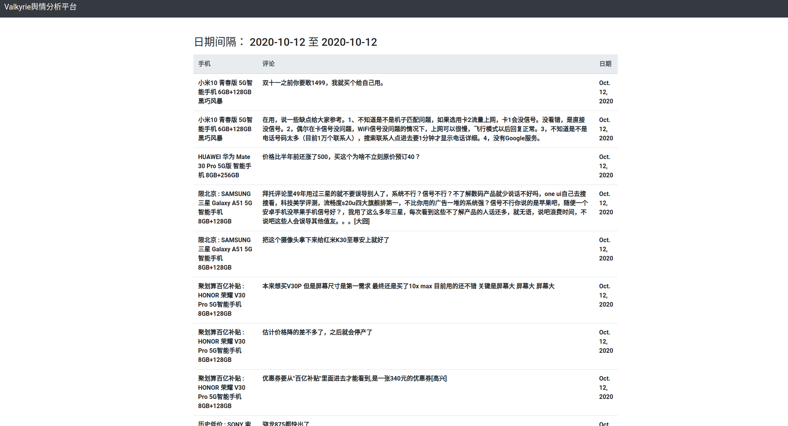

# 毕业项目-Valkyrie


*Valkyrie*是“什么值得买”手机與情平台

整个项目结构如下
```
.
├── docker-compose.yaml
├── init.sql
├── mysqldump.sql
├── README.md
├── requirements.txt
├── tools
│   ├── pandas.ipynb
│   └── __pycache__
├── valkyrie_analyzer
│   ├── data
│   └── pandas_analyzer.py
├── valkyrie_app
│   ├── manage.py
│   ├── valkyrie_app
│   └── valkyrie_phones
├── valkyrie_worker
│   ├── scrapy.cfg
│   └── valkyrie_worker
└── venv
    ├── bin
    ├── etc
    ├── include
    ├── lib
    ├── lib64 -> lib
    ├── pyvenv.cfg
    └── share

```

## 环境初始化
### 虚拟环境
所有第三方库都在`requirements.txt`中

### 数据库
数据库是通过docker-compose设立的mysql容器， 运行
```
docker-compose up -d
```
来初始化

作业开发数据已dump在`mysqldump.sql`中。

## Scrapy 爬虫
`valkyrie_worker`包含所有scrapy爬虫相关文件

## 数据清洗情感分析
`valkyrie_analyzer`包含数据清洗和分析, 基于pandas和snownlp

作为cron job运行
```
python pandas_analyzer.py
```
即可

## Django 应用
`valkyrie_app`包含所有Django相关的文件，图标是基于google charts生成

首页


手机页面


日期搜索


日期搜索

